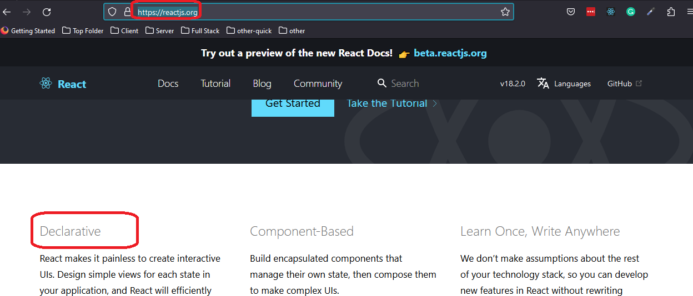

<h2>Motivation</h2>
<p>usePostData is a custom hook that can post data. It return [result, isLoading, error]</p>
<p>given isLoading we might want to show progress .Given error we might want to show error .So why not do a component for this ? - thats the purpose of this repository</p>


<h2>Declerative design</h2>
What is nice about this design is that it embrace the declerative concept , which is one of react foundations



<h2>Design</h2>
The design is composed of three layers
<ul>
<li>IPostData<BodyType> - typescript interface generic</li>
<li>usePostData<BodyType> - custom hooks to post data</li>
<li> GenericPostData<BodyType>(props: IPostData<BodyType>) - generic component to show : error \ success \ loading . This component is posting data when its url and body properties are set by its parent</li>
</ul>


<h2>IPostData<BodyType></h2>

```ts
 interface IPostData<BodyType> {
    url: string;
    body : BodyType;
    successComponent: ReactElement;
    errorComponent: ReactElement;
    loadingComponent: ReactElement;
  }
```

<h2>using the generic post data component</h2>

```ts

<GenericPostData
        url="https://jsonplaceholder.typicode.com/posts"
        body={body}
        successComponent={
          <Alert severity="success">
            This is an auccess alert — check it out!
          </Alert>
        }
        loadingComponent={
          <>
            Loading ...
            <CircularProgress />
          </>
        }
        errorComponent={
          <Alert severity="error">This is an error alert — check it out!</Alert>
        }
      />

```


<h2>Generic design</h2>
this GenericPostData component is generic in the sense that you can 
<ul>
<li>invoke it with any POST based url</li>
<li>send any data type</li>
<li>use any error component</li>
<li>use any loading component</li>
<li>use any success component</li>
</ul>
